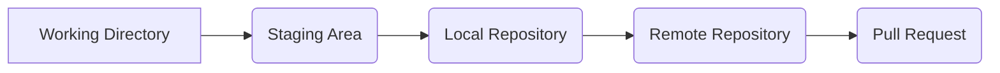
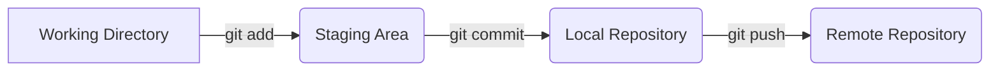
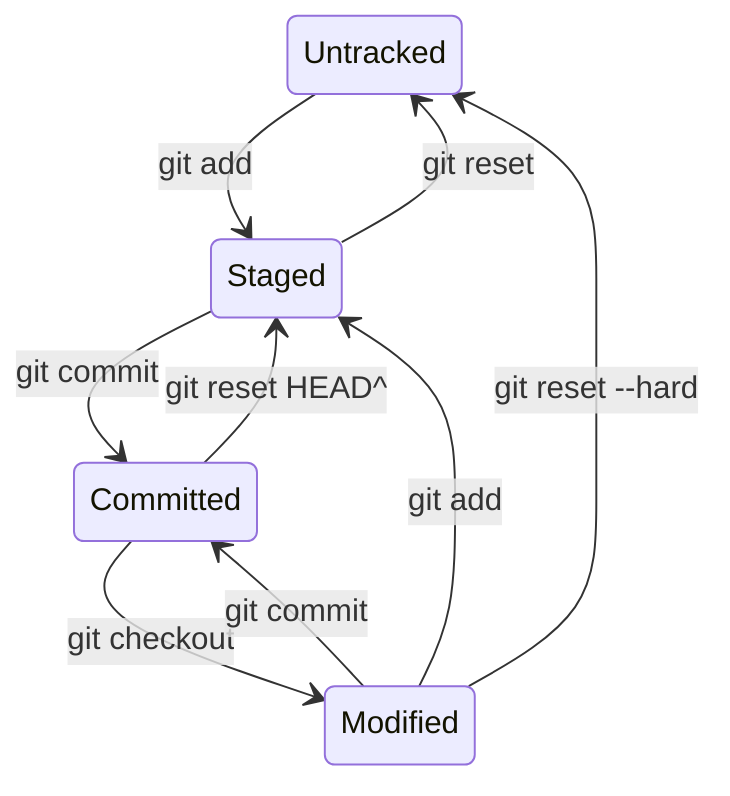

# What is Git?
Git is a popular distributed version control system used for tracking changes in software development projects. It was created by Linus Torvalds in 2005 and has since become one of the most widely used version control systems.

Git allows multiple developers to work on the same codebase simultaneously, while keeping track of changes made by each developer. This helps in avoiding conflicts and ensuring that everyone is working on the most up-to-date version of the code.

Git uses a branching model, which allows developers to create separate branches of the codebase to work on specific features or fixes. Once the work is complete, the branch can be merged back into the main branch of the codebase.

Git also provides features for code review, collaboration, and integration with various development tools. It has become an essential tool for modern software development and is widely used in open-source and commercial software projects alike.

# What does the git software development process look like?

In the flowchart above, a developer starts by making changes to the files in the working directory. Then, they add the changes they want to include in the next commit to the staging area. Once the changes are staged, the developer commits them to the local repository. Finally, the committed changes are pushed to the remote repository, where they can be reviewed and merged into the main branch of the codebase using a pull request.

The Git software development process involves several stages or states, including:
- Working Directory (Untracked): This is the state where a developer creates or modifies files in the local copy of the repository.
- Staging Area (Local): This is the state where a developer selects which changes they want to include in the next commit.
- Local Repository: This is the state where the committed changes are stored in the local copy of the repository.
- Remote Repository: This is the state where the committed changes are pushed from the local repository to a remote repository, such as GitHub or GitLab.
- Pull Request: This is the state where a developer requests that their changes be reviewed and merged into the main branch of the remote repository.

In the diagram above, the changes made in the working directory are added to the staging area using the "git add" command. Once the changes are in the staging area, they are committed to the local repository using the "git commit" command. Finally, the committed changes are pushed to the remote repository using the "git push" command.

The transitions between these states are below:
- Working Directory to Staging Area: A developer adds changes to the staging area using the `git add` command.
- Staging Area to Local Repository: A developer commits the changes in the staging area to the local repository using the `git commit` command.
- Local Repository to Remote Repository: A developer pushes the committed changes from the local repository to the remote repository using the `git push` command.
- Remote Repository to Pull Request: A developer creates a pull request on the remote repository to request that their changes be reviewed and merged into the main branch.
- Pull Request to Remote Repository: After the changes are reviewed and approved, they are merged into the main branch of the remote repository.

# Working locally

