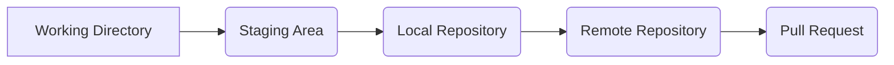
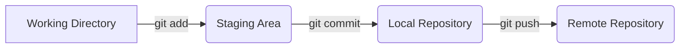
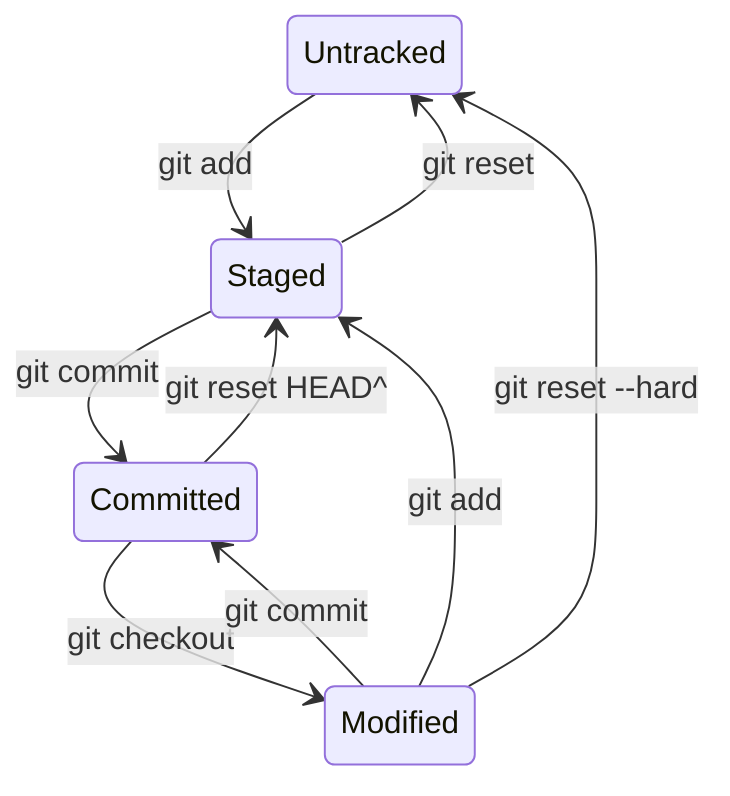
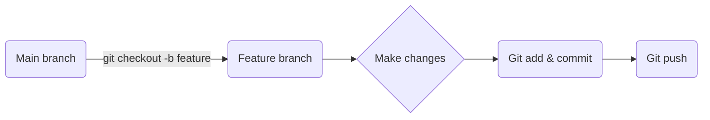
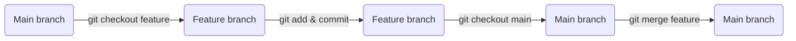
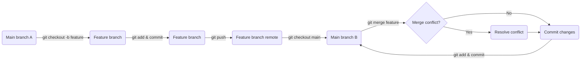
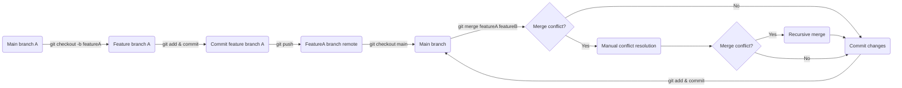
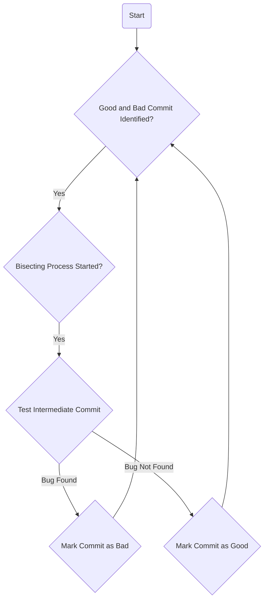

# What is Git?
Git is a popular distributed version control system used for tracking changes in software development projects. It was created by Linus Torvalds in 2005 and has since become one of the most widely used version control systems.

Git allows multiple developers to work on the same codebase simultaneously, while keeping track of changes made by each developer. This helps in avoiding conflicts and ensuring that everyone is working on the most up-to-date version of the code.

Git uses a branching model, which allows developers to create separate branches of the codebase to work on specific features or fixes. Once the work is complete, the branch can be merged back into the main branch of the codebase.

Git also provides features for code review, collaboration, and integration with various development tools. It has become an essential tool for modern software development and is widely used in open-source and commercial software projects alike.

# What does the git software development process look like?

In the flowchart above, a developer starts by making changes to the files in the working directory. Then, they add the changes they want to include in the next commit to the staging area. Once the changes are staged, the developer commits them to the local repository. Finally, the committed changes are pushed to the remote repository, where they can be reviewed and merged into the main branch of the codebase using a pull request.

The Git software development process involves several stages or states, including:
- Working Directory (Untracked): This is the state where a developer creates or modifies files in the local copy of the repository.
- Staging Area (Local): This is the state where a developer selects which changes they want to include in the next commit.
- Local Repository: This is the state where the committed changes are stored in the local copy of the repository.
- Remote Repository: This is the state where the committed changes are pushed from the local repository to a remote repository, such as GitHub or GitLab.
- Pull Request: This is the state where a developer requests that their changes be reviewed and merged into the main branch of the remote repository.

# Promoting code between states

In the diagram above, the changes made in the working directory are added to the staging area using the `git add` command. Once the changes are in the staging area, they are committed to the local repository using the `git commit` command. Finally, the committed changes are pushed to the remote repository using the `git push` command.

The transitions between these states are below:
- Working Directory to Staging Area: A developer adds changes to the staging area using the `git add` command.
- Staging Area to Local Repository: A developer commits the changes in the staging area to the local repository using the `git commit` command.
- Local Repository to Remote Repository: A developer pushes the committed changes from the local repository to the remote repository using the `git push` command.
- Remote Repository to Pull Request: A developer creates a pull request on the remote repository to request that their changes be reviewed and merged into the main branch.
- Pull Request to Remote Repository: After the changes are reviewed and approved, they are merged into the main branch of the remote repository.

# Working locally

Working locally using Git involves a few basic steps. Here's a general overview:

1. Create a local repository: To start working locally with Git, you first need to create a local repository on your computer. You can do this by creating a new directory and running the "git init" command within that directory. This will create a new repository that you can use to manage your code.

2. Create a branch: Before making any changes to your code, it's a good idea to create a new branch. This will allow you to work on your changes without affecting the main codebase. To create a new branch, use the "git checkout -b" command followed by the name of the new branch.

3. Make changes: Once you've created a new branch, you can start making changes to the code. Use your favorite text editor or integrated development environment (IDE) to edit the code files as needed.

4. Add changes: After you've made changes to the code, you need to tell Git which files you want to include in the next commit. Use the "git add" command to stage changes for the next commit. You can either add specific files using the file name, or you can add all changes using the "git add ." command.

5. Commit changes: Once you've staged your changes, you can commit them to your local repository using the "git commit" command. When you commit changes, you should include a brief message that describes the changes you've made.

6. Repeat steps 3-5 as needed: Continue working on your code, making changes, staging them, and committing them as needed. You can switch between branches using the "git checkout" command, and you can view your current branch and the status of your changes using the "git status" command.

7. When you are happy with the contents of your local branch, push your changes to the remote repository. 

# Branching

In the diagram above, a developer creates a new feature branch from the main branch using the `git checkout -b feature` command. They can then make changes to the code in the feature branch and add and commit those changes using the `git add` and "git commit" commands. Once the changes are ready, the developer can push the changes to the feature branch using the `git push` command.

The feature branch can continue to be developed and tested independently of the main branch. Once the feature is complete, it can be merged back into the main branch using a merge operation. This allows the changes made in the feature branch to be incorporated into the main branch without disrupting the development of other features or the main branch.

Branching is the process of creating a new line of development that diverges from the main line of development, called the `master` branch. A branch can be thought of as a snapshot of the codebase at a particular point in time.

Creating a branch in Git allows developers to work on new features or bug fixes without affecting the code in the main branch. Each branch can have its own commit history, changes, and version control. This enables developers to experiment with new ideas, collaborate on different features, and work on multiple tasks in parallel.

When a developer creates a new branch, they can make changes to the code without affecting the code in the main branch. Once the changes are complete, they can be merged back into the main branch using a merge operation, combining the changes made in the branch with the changes made in the main branch.

Git also supports multiple branches, so developers can create and manage different branches for different tasks and features. This enables developers to work on features independently without disrupting the development of other features or the main branch.

# Merging
In Git, merging is the process of combining changes from one branch (the `source branch`) into another branch (the `target branch`). The purpose of merging is to incorporate changes made in one branch into another branch, typically to integrate a new feature or fix a bug.

There are several types of merging in Git, including:
## Fast-forward merging

Fast-forward merging occurs when the target branch has not diverged from the source branch since the time the branch was created. In this case, Git simply moves the pointer of the target branch to the tip of the source branch. In the diagram above, a developer creates a feature branch from the main branch using the `git checkout` command. They can then make changes to the code in the feature branch and add and commit those changes using the `git add` and `git commit` commands. Once the changes are complete, the developer can checkout the main branch and initiate a merge with the feature branch using the `git merge` command.

If the changes made in the feature branch have not diverged from the main branch since the feature branch was created, Git will perform a fast-forward merge. This means that the changes made in the feature branch will be incorporated into the main branch by simply moving the pointer of the main branch to the tip of the feature branch.

Once the merge is complete, the changes made in the feature branch will be incorporated into the main branch, and the developer can continue to work on new features or bug fixes in the feature branch.

## Three-way merging

Three-way merging occurs when the target and source branches have diverged and Git needs to merge the changes made in both branches. Git identifies the common ancestor of the two branches and combines the changes made in each branch since that ancestor. In the flowchart above, a developer creates a feature branch from the main branch using the `git checkout -b` command. They can then make changes to the code in the feature branch and add and commit those changes using the `git add` and `git commit` commands. Once the changes are complete, the developer can push the changes to the remote feature branch using the `git push` command.

When the changes are ready to be merged into the main branch, the developer checks out the main branch and initiates a merge with the feature branch using the `git merge` command. If the changes made in the feature branch have diverged from the main branch, Git will perform a three-way merge.

During the merge process, Git will attempt to automatically resolve any conflicts between the two branches. If Git is unable to resolve the conflicts automatically, it will pause the merge process and prompt the developer to resolve the conflicts manually using Git's conflict resolution tools.

Once the conflicts have been resolved, the developer can add and commit the changes using the `git add` and `git commit` commands. If there were no conflicts, the merge can be completed immediately using the `git merge` command.

After the merge is complete, the changes made in the feature branch will be incorporated into the main branch, and the developer can continue to work on new features or bug fixes in the feature branch.

## Recursive merging

Recursive merging is a variant of three-way merging that is used for merging complex branching structures. In the flowchart above, the steps leading up to the merge are identical to those in the three-way merge flowchart. However, if there are still conflicts remaining after the manual resolution step, Git will initiate a recursive merge.

A recursive merge is used when there are more than two branches to merge. In this case, Git will compare the changes made in both branches to a common ancestor and attempt to merge them in a way that preserves as much of the changes as possible.

If Git is unable to automatically resolve the conflicts during a recursive merge, it will again pause the merge process and prompt the developer to resolve the conflicts manually. Once the conflicts have been resolved, the developer can add and commit the changes using the `git add` and `git commit` commands.

If there were no conflicts, the merge can be completed immediately using the `git merge` command. If there are still conflicts after the recursive merge step, Git will continue to prompt the developer to resolve them manually until they have been resolved or the merge is abandoned.

# What is a git bisect?
Git bisect is a command-line tool used to find the commit that introduced a specific bug or issue in a Git repository. It works by performing a binary search through the commit history of the repository, which involves dividing the range of commits to be searched in half repeatedly until the specific commit that introduced the issue is identified.

To use Git bisect, you need to have a known "good" and "bad" commit in the repository. The "good" commit is a version of the codebase that did not have the bug, while the "bad" commit is a version of the codebase that has the bug. Git bisect then automatically checks out a middle commit between the "good" and "bad" commit and asks the user to test whether the bug is still present in that commit. Depending on the test result, Git bisect will narrow down the range of commits to search and repeat the process until it identifies the exact commit that introduced the bug.

Using Git bisect can significantly reduce the time and effort required to find the commit that caused an issue, making it a valuable tool for debugging in large and complex codebases.

# What does the git bisect workflow look like?

Here's a high-level overview of the workflow for using Git bisect:

1. Identify a known "good" commit: Start by identifying a commit in the Git repository that you know does not have the issue or bug you're trying to debug. You can identify this commit by checking out previous versions of the codebase or by asking other developers on your team.

2. Identify a known "bad" commit: Similarly, identify a commit in the repository that you know has the issue or bug you're trying to debug. This can be a commit that you recently made, or one that was reported by a user or tester.

3. Start the bisecting process: Use the git bisect start command to start the bisecting process. This tells Git that you want to find the commit that introduced the bug, and that you'll provide Git with a "good" and "bad" commit to start the search.

4. Mark the good and bad commits: Use the git bisect good <commit> and git bisect bad <commit> commands to mark the known good and bad commits, respectively. Git will then use these commits to start the binary search.

5. Test intermediate commits: Git will check out an intermediate commit between the good and bad commits. Test this commit to determine whether it has the bug or not.

6. Mark the commit as good or bad: Depending on whether the intermediate commit has the bug or not, use the git bisect good or git bisect bad command to tell Git whether to search in the earlier or later half of the commit history.

7. Repeat testing and marking: Repeat steps 5-6 until Git identifies the commit that introduced the bug.

8. End the bisecting process: Once Git identifies the commit that introduced the bug, use the git bisect reset command to exit the bisecting process and return to the current branch.

Overall, the workflow for using Git bisect involves identifying a good and bad commit, starting the bisecting process, testing intermediate commits, and marking each commit as good or bad until Git identifies the specific commit that introduced the issue.
